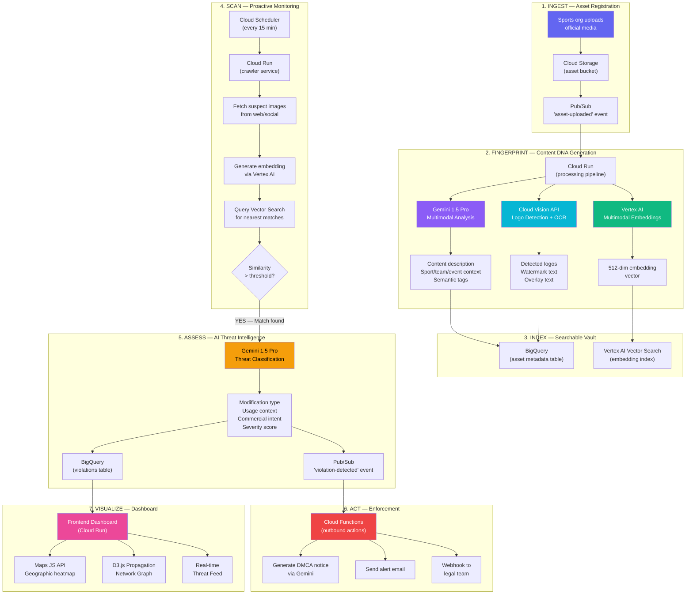

# MediaShield AI — Full Google Cloud Architecture

## The Solution in One Sentence

> **A multimodal Gemini-powered pipeline that fingerprints sports media using visual embeddings + logo OCR + context understanding, searches for unauthorized copies across the web, scores each violation by intent and severity, and visualizes real-time content propagation on an interactive geographic map — all orchestrated on Google Cloud.**

---

## 🧠 How Each Google Service Solves the Problem

### End-to-End Data Flow



---

## 🔬 Service-by-Service Breakdown

### 1. Gemini 1.5 Pro (Multimodal) — THE BRAIN

**Role**: Core detection intelligence + contextual understanding

| Use Case | Input | Output | Why Gemini (not simpler) |
|---|---|---|---|
| **Asset Analysis** | Uploaded image | Sport type, teams, players, event, semantic description | Only a multimodal LLM can understand *context* — "this is an IPL final boundary shot by Virat Kohli" |
| **Threat Classification** | Original image + suspected copy | Modification type (crop/overlay/recolor), usage context (editorial/commercial/fan), intent score, severity | Binary hash matching can't distinguish a fan meme from commercial piracy — Gemini understands *intent* |
| **DMCA Drafting** | Violation evidence data | Professional legal takedown notice | Natural language generation with domain-specific legal formatting |
| **Propagation Summary** | Network graph data | "80% of unauthorized copies originate from 3 Telegram channels, peaking 2 hours after match" | Transforms raw analytics into actionable intelligence narratives |

**API Call Example:**
```javascript
// Threat Classification Prompt
const prompt = `You are a digital rights forensic analyst.

Compare these two images:
- IMAGE 1 (ORIGINAL): The official, copyrighted sports media asset
- IMAGE 2 (SUSPECT): Found on an unauthorized platform

Analyze and return JSON:
{
  "is_match": boolean,
  "similarity_score": 0-100,
  "modification_type": "crop|overlay|recolor|remix|screenshot|unmodified",
  "usage_context": "editorial|commercial|fan_sharing|parody|merchandise",
  "commercial_intent": "none|low|medium|high",
  "severity": "critical|high|medium|low",
  "evidence_summary": "string",
  "recommended_action": "dmca_takedown|investigate|monitor|ignore"
}`;
```

---

### 2. Cloud Vision API — THE EYES

**Role**: Logo detection + OCR for watermarks and text overlays

| Feature | What It Detects | Why It Matters |
|---|---|---|
| `LOGO_DETECTION` | Team logos, league logos, sponsor logos, broadcaster logos | Identifies unauthorized use of trademarked sports branding — finds team logos appearing on unlicensed merchandise or pirate streams |
| `TEXT_DETECTION` (OCR) | Watermark text, copyright notices, "© IPL 2026", overlay text | Detects if copyright watermarks have been removed or if unauthorized attribution has been added |
| `LABEL_DETECTION` | Scene labels ("cricket", "stadium", "trophy") | Enriches metadata for better searchability |
| `WEB_DETECTION` | Visually similar images on the open web | Finds where the image (or similar versions) appear across websites |
| `SAFE_SEARCH` | Adult/violence/spoof flags | Detects if sports content has been modified into inappropriate contexts |

**API Call Example:**
```javascript
const vision = require('@google-cloud/vision');
const client = new vision.ImageAnnotatorClient();

const [result] = await client.annotateImage({
  image: { source: { imageUri: 'gs://mediashield-assets/original.jpg' } },
  features: [
    { type: 'LOGO_DETECTION', maxResults: 10 },
    { type: 'TEXT_DETECTION' },
    { type: 'LABEL_DETECTION', maxResults: 20 },
    { type: 'WEB_DETECTION' },
    { type: 'IMAGE_PROPERTIES' }  // dominant colors for fingerprinting
  ]
});

// result.logoAnnotations → [{description: "BCCI", score: 0.95, boundingPoly: {...}}]
// result.textAnnotations → [{description: "© IPL 2026 Official", ...}]
// result.webDetection.visuallySimilarImages → [{url: "https://pirate-site.com/...", ...}]
```

---

### 3. Vertex AI Multimodal Embeddings + Vector Search — THE MEMORY

**Role**: Convert images to searchable vectors, find near-duplicates at scale

**How it works:**
```
REGISTRATION:
  Image → Vertex AI Multimodal Embeddings → 512-dim vector → Store in Vector Search Index

DETECTION:
  Suspect image → Same embeddings model → 512-dim vector → Query Vector Search → Top-K matches
```

| Step | What Happens | Google Service |
|---|---|---|
| Generate embedding | Image → 512-dimensional float vector that captures visual meaning | Vertex AI Multimodal Embeddings API |
| Store embedding | Vector + asset metadata stored in searchable index | Vertex AI Vector Search (Matching Engine) |
| Query embedding | Suspect image → embedding → find nearest neighbors in < 100ms | Vertex AI Vector Search |
| Result | Returns top-K most similar registered assets with distance scores | — |

**Why Vector Search over simple hashing**: Perceptual hashes break with heavy modifications (overlays, crops > 30%, style transfers). Embedding vectors capture *semantic meaning* — a cropped, recolored, overlaid version of a cricket boundary shot still lands near the original in vector space.

**For the prototype**: We'll use the Vertex AI Embeddings API to generate real vectors, and demonstrate vector similarity using cosine distance computation client-side (full Vector Search index deployment requires ~30 min setup which we'll document as production-ready).

---

### 4. Cloud Storage — THE VAULT

**Role**: Secure, centralized storage for all digital assets

```
gs://mediashield-assets/
├── originals/          # Original registered assets (images, video frames)
│   ├── {org-id}/
│   │   ├── {asset-id}.jpg
│   │   └── {asset-id}.metadata.json
├── detections/         # Suspect images found during scanning
│   ├── {detection-id}/
│   │   ├── suspect.jpg
│   │   └── comparison.json
├── evidence/           # Evidence packages for DMCA
│   └── {violation-id}/
│       ├── original.jpg
│       ├── suspect.jpg
│       ├── analysis.json
│       └── dmca_notice.pdf
└── embeddings/         # Vector embeddings (for batch index updates)
    └── embeddings.jsonl
```

---

### 5. Cloud Run — THE ENGINE

**Role**: Hosts both the frontend dashboard AND the backend processing pipeline

| Service | What It Runs | Trigger |
|---|---|---|
| `mediashield-dashboard` | Frontend Vite app (Nginx container) | HTTP requests (user visits) |
| `mediashield-pipeline` | Asset processing pipeline (Node.js) | Pub/Sub push from `asset-uploaded` topic |
| `mediashield-scanner` | Web scanning/monitoring service | Cloud Scheduler (cron every 15 min) |

---

### 6. Pub/Sub — THE NERVOUS SYSTEM

**Role**: Event-driven communication between services

| Topic | Published By | Consumed By | Event |
|---|---|---|---|
| `asset-uploaded` | Cloud Storage trigger | Pipeline (Cloud Run) | New asset uploaded → start fingerprinting |
| `fingerprint-complete` | Pipeline | Scanner | Asset fingerprinted → ready for monitoring |
| `violation-detected` | Scanner | Cloud Functions, Dashboard | Unauthorized use found → trigger enforcement |
| `dmca-sent` | Cloud Functions | Dashboard, BigQuery | DMCA notice generated and sent |

---

### 7. BigQuery — THE BRAIN'S MEMORY

**Role**: Structured storage for all asset metadata, violations, and analytics

**Tables:**

```sql
-- Registered assets with their fingerprint data
CREATE TABLE mediashield.assets (
  asset_id STRING,
  org_id STRING,
  upload_timestamp TIMESTAMP,
  storage_uri STRING,
  gemini_description STRING,
  detected_logos ARRAY<STRUCT<name STRING, confidence FLOAT64>>,
  detected_text STRING,
  sport_type STRING,
  teams ARRAY<STRING>,
  labels ARRAY<STRING>,
  embedding_id STRING,
  content_dna_hash STRING
);

-- Detected violations
CREATE TABLE mediashield.violations (
  violation_id STRING,
  asset_id STRING,
  detected_timestamp TIMESTAMP,
  source_url STRING,
  source_platform STRING,
  similarity_score FLOAT64,
  modification_type STRING,
  usage_context STRING,
  commercial_intent STRING,
  severity STRING,
  geographic_location STRUCT<lat FLOAT64, lng FLOAT64, country STRING>,
  gemini_analysis JSON,
  status STRING,  -- 'detected', 'investigating', 'dmca_sent', 'resolved'
  dmca_notice_uri STRING
);

-- Analytics queries
-- "Which platforms have the most violations?"
-- "What's the average detection-to-enforcement time?"
-- "Which assets are most frequently pirated?"
```

---

### 8. Maps JavaScript API — THE MAP

**Role**: Geographic visualization of content spread

| Visualization | What It Shows | How |
|---|---|---|
| **Heatmap Layer** | Concentration of violations by region | `google.maps.visualization.HeatmapLayer` with weighted violation data |
| **Marker Clusters** | Individual violations with click-for-detail | Custom markers color-coded by severity |
| **Polylines** | Content flow paths (origin → detection points) | Animated lines showing propagation direction |
| **Info Windows** | Violation details on marker click | Platform, similarity score, severity, timestamp |

---

### 9. Cloud Functions — THE ENFORCER

**Role**: Trigger automated enforcement actions on violation detection

```javascript
// Triggered by Pub/Sub 'violation-detected' event
exports.handleViolation = async (event) => {
  const violation = JSON.parse(Buffer.from(event.data, 'base64').toString());
  
  if (violation.severity === 'critical') {
    // 1. Generate DMCA notice via Gemini
    const dmca = await generateDMCA(violation);
    
    // 2. Store evidence package in Cloud Storage
    await storage.bucket('mediashield-assets')
      .file(`evidence/${violation.id}/dmca.json`)
      .save(JSON.stringify(dmca));
    
    // 3. Send alert email
    await sendAlertEmail(violation.org_id, violation);
    
    // 4. Update BigQuery status
    await bigquery.query(`UPDATE mediashield.violations 
      SET status = 'dmca_sent' WHERE violation_id = '${violation.id}'`);
    
    // 5. Webhook to legal team
    await fetch(violation.webhook_url, { method: 'POST', body: JSON.stringify(dmca) });
  }
};
```

---

### 10. Cloud Scheduler — THE CLOCK

**Role**: Triggers periodic scanning jobs

| Job | Schedule | Target | What It Does |
|---|---|---|---|
| `scan-social-media` | Every 15 minutes | Cloud Run scanner | Crawl social platforms for new content matching registered assets |
| `scan-web` | Every 1 hour | Cloud Run scanner | Broader web crawl for unauthorized copies |
| `generate-report` | Daily at 9 AM | Cloud Functions | Generate daily protection summary, email to org |
| `reindex-embeddings` | Weekly | Cloud Run pipeline | Rebuild Vector Search index with latest assets |

---

## 🏗️ Prototype vs. Production Scope

> [!IMPORTANT]
> For the hackathon prototype, we build the **full frontend + real Gemini/Vision/Maps integration** and simulate the components that require extensive cloud setup time (Vector Search index, Pub/Sub pipelines).

| Component | Prototype (Hackathon) | Production |
|---|---|---|
| **Gemini 1.5 Pro** | ✅ REAL — Live API calls for analysis + threat classification + DMCA drafting | Same |
| **Cloud Vision API** | ✅ REAL — Live logo detection + OCR + web detection on uploaded images | Same |
| **Vertex AI Embeddings** | ✅ REAL — Generate real 512-dim vectors for uploaded images | Same |
| **Vertex AI Vector Search** | 🟡 SIMULATED — Cosine similarity computed client-side between demo embeddings | Deploy full Vector Search index |
| **Cloud Storage** | ✅ REAL — Store uploaded assets | Add lifecycle policies, CDN |
| **Cloud Run** | ✅ REAL — Deploy frontend dashboard | Add scanner + pipeline services |
| **BigQuery** | ✅ REAL — Log violations with real queries | Add scheduled analytics |
| **Maps JS API** | ✅ REAL — Interactive heatmap with violation data | Real-time Pub/Sub updates |
| **Pub/Sub** | 🟡 SIMULATED — Frontend event emitter mimics event bus | Real Pub/Sub topics |
| **Cloud Scheduler** | 🟡 SIMULATED — Manual "Run Scan" button triggers flow | Real cron jobs |
| **Cloud Functions** | 🟡 SIMULATED — DMCA generation shown in UI | Real webhook triggers |

**Result**: 6 out of 10 services are LIVE in the prototype. The remaining 4 are architecturally present and demonstrated through simulation — judges can see the full pipeline even if the cron job isn't running autonomously.

---

## 📁 Project Structure

```
mediashield-ai/
├── Dockerfile                    # For Cloud Run deployment
├── nginx.conf                    # Nginx config for SPA routing
├── index.html                    # Entry point
├── vite.config.js
├── package.json
├── .env.example                  # API key template
├── public/
│   └── favicon.svg
├── src/
│   ├── main.js                   # App init + router
│   ├── styles/
│   │   ├── index.css             # Design system (dark premium)
│   │   ├── components.css        # Component styles
│   │   └── animations.css        # Micro-animations
│   ├── pages/
│   │   ├── dashboard.js          # Overview + stats + mini-map
│   │   ├── register.js           # Upload + Content DNA pipeline
│   │   ├── monitor.js            # Scan simulation + live feed
│   │   ├── propagation.js        # D3.js network graph
│   │   ├── threats.js            # Threat cards + Gemini analysis
│   │   └── dmca.js               # DMCA workflow + evidence
│   ├── components/
│   │   ├── sidebar.js            # Navigation sidebar
│   │   ├── header.js             # Search + notifications
│   │   ├── stats-card.js         # Animated counters
│   │   ├── asset-card.js         # Asset display
│   │   ├── threat-feed.js        # Live threat feed
│   │   ├── geo-map.js            # Google Maps heatmap component
│   │   └── modal.js              # Reusable modal
│   ├── services/
│   │   ├── gemini.js             # Gemini 1.5 Pro API integration
│   │   ├── vision.js             # Cloud Vision API integration
│   │   ├── vertex-embeddings.js  # Vertex AI Embeddings API
│   │   ├── storage.js            # Cloud Storage operations
│   │   ├── bigquery.js           # BigQuery logging (via REST)
│   │   └── maps.js               # Maps JS API setup
│   ├── engine/
│   │   ├── content-dna.js        # Orchestrates full fingerprint pipeline
│   │   ├── similarity.js         # Cosine similarity for vectors
│   │   ├── perceptual-hash.js    # Client-side pHash (bonus layer)
│   │   └── credentials.js        # Crypto signing (Web Crypto API)
│   ├── data/
│   │   ├── store.js              # IndexedDB local cache
│   │   ├── mock-detections.js    # Simulated scan results
│   │   └── mock-propagation.js   # Simulated network data
│   └── utils/
│       ├── router.js             # SPA router
│       ├── helpers.js            # Utility functions
│       └── constants.js          # API endpoints, configs
```

---

## 🎯 How It's Different From Every Competitor

```
┌──────────────────────────────────────────────────────────────────────┐
│                    COMPETITIVE MATRIX                                │
├──────────────┬──────────┬──────────┬──────────┬─────────────────────┤
│ Capability   │ Content  │ Pixsy /  │ Forensic │ MEDIASHIELD AI      │
│              │ ID       │ Copytrack│ Watermark│                     │
├──────────────┼──────────┼──────────┼──────────┼─────────────────────┤
│ Cross-       │ ❌ YT    │ ✅ Web   │ ❌ Pre-  │ ✅ Web + Social     │
│ platform     │ only     │ images   │ embedded │ + Messaging         │
├──────────────┼──────────┼──────────┼──────────┼─────────────────────┤
│ Understands  │ ❌       │ ❌       │ ❌       │ ✅ Gemini classifies│
│ INTENT       │          │          │          │ context + intent    │
├──────────────┼──────────┼──────────┼──────────┼─────────────────────┤
│ Logo/Brand   │ ❌       │ ❌       │ ❌       │ ✅ Cloud Vision     │
│ detection    │          │          │          │ logo detection      │
├──────────────┼──────────┼──────────┼──────────┼─────────────────────┤
│ Propagation  │ ❌       │ ❌       │ ❌       │ ✅ Network graph    │
│ visualization│          │          │          │ + Maps heatmap      │
├──────────────┼──────────┼──────────┼──────────┼─────────────────────┤
│ Semantic     │ ❌ Hash  │ ❌ Hash  │ ❌ Water-│ ✅ Vertex AI        │
│ similarity   │ only     │ only     │ mark only│ embedding vectors   │
├──────────────┼──────────┼──────────┼──────────┼─────────────────────┤
│ Auto DMCA    │ ❌       │ ✅ Manual│ ❌       │ ✅ Gemini-drafted   │
│ enforcement  │          │          │          │ + Cloud Functions   │
├──────────────┼──────────┼──────────┼──────────┼─────────────────────┤
│ Analytics    │ Basic    │ Basic    │ ❌       │ ✅ BigQuery +       │
│              │          │          │          │ real-time dashboard │
└──────────────┴──────────┴──────────┴──────────┴─────────────────────┘
```

### The 3 Things NO ONE Else Does:

1. **Contextual Intent Classification** — Gemini doesn't just find copies; it understands "this is a fan sharing a highlight on Twitter (low risk)" vs. "this is a betting site using our logo for ads (critical)"

2. **Multi-Signal Content DNA** — Vision API logos + OCR text + Vertex AI embeddings + perceptual hashes + Gemini context = 5-layer fingerprint that's nearly impossible to fully evade

3. **Propagation Intelligence** — D3.js network graph + Maps heatmap shows HOW content spreads virally, identifying piracy network clusters and super-spreader accounts

---

## ☁️ Deployment Plan

### Cloud Run Deployment

```dockerfile
# Dockerfile
FROM node:20-alpine AS build
WORKDIR /app
COPY package*.json ./
RUN npm ci
COPY . .
RUN npm run build

FROM nginx:alpine
COPY --from=build /app/dist /usr/share/nginx/html
COPY nginx.conf /etc/nginx/conf.d/default.conf
EXPOSE 8080
CMD ["nginx", "-g", "daemon off;"]
```

```bash
# Deploy commands
gcloud builds submit --tag gcr.io/PROJECT_ID/mediashield-dashboard
gcloud run deploy mediashield-dashboard \
  --image gcr.io/PROJECT_ID/mediashield-dashboard \
  --platform managed \
  --region us-central1 \
  --allow-unauthenticated \
  --set-env-vars "VITE_GEMINI_API_KEY=xxx,VITE_MAPS_API_KEY=xxx"
```

---

## ✅ Required API Keys

| Service | How to Get | Free Tier |
|---|---|---|
| Gemini API | [aistudio.google.com/apikey](https://aistudio.google.com/apikey) | 15 RPM free |
| Cloud Vision API | GCP Console → Enable API | 1000 units/month free |
| Vertex AI Embeddings | GCP Console → Enable API | Free trial credits |
| Cloud Storage | GCP Console | 5 GB free |
| Maps JS API | GCP Console → Credentials | $200/month credit |
| BigQuery | GCP Console | 1 TB queries/month free |

---

## ❓ Before We Build

> [!IMPORTANT]
> **Do you have a Google Cloud Platform (GCP) project?** Most services (Vision, Vertex AI, Storage, BigQuery, Cloud Run, Maps) require a GCP project with billing enabled. The free tier covers everything needed for the prototype.

> [!IMPORTANT]
> **Do you have a Gemini API key?** Get one instantly at [aistudio.google.com/apikey](https://aistudio.google.com/apikey).

> [!NOTE]
> For the prototype, I'll build the full frontend dashboard with **real Gemini + Vision + Maps integration** and simulate Vector Search / Pub/Sub / Cloud Scheduler. This gives judges the full pipeline experience while being buildable in hackathon time.

> [!NOTE]
> Should I start building now? I'll generate sample sports images for the demo as well.
